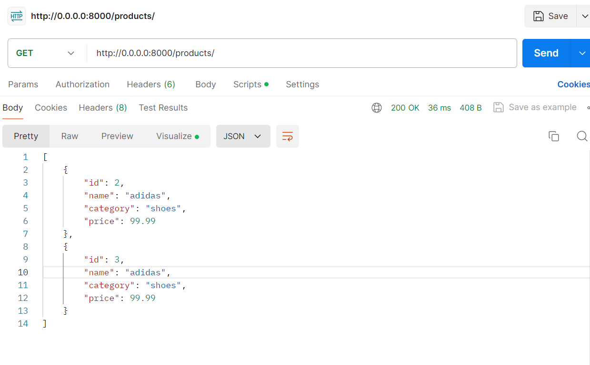
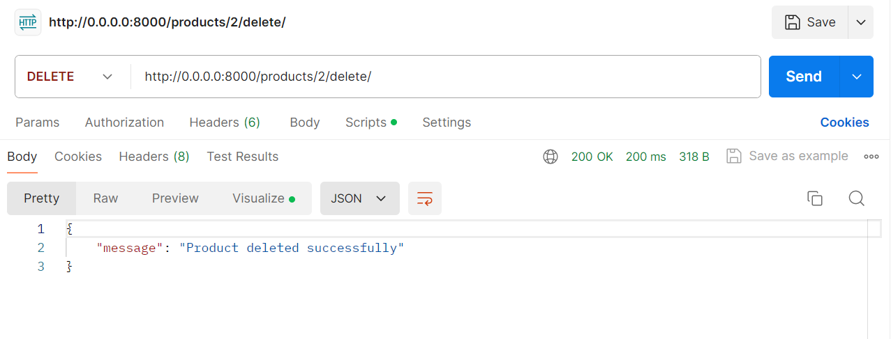
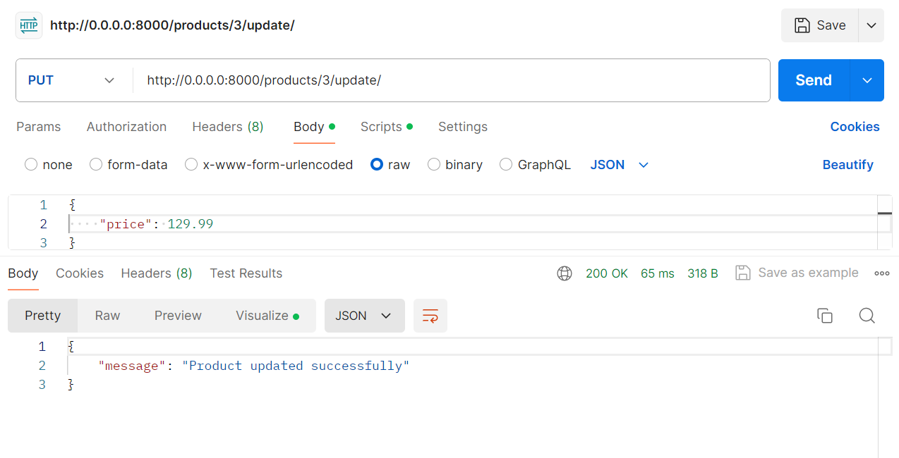

# Dockerized Django Product API

This project is based on Django and it provides RESTful API for managing products. It allows us to perform CRUD (Create, Read, Update and Delete) operations on products using HTTP methods. Docker is used for containerizing this project for easy deployment and scalability.

### Features
There are five API endpoints which have different functions:
#### Create Product:
##### Endpoint: POST /products/create/
##### Request Body: JSON data with name, category, and price fields.
##### Response: JSON response with the ID of the created product.

#### Get Product by ID:
##### Endpoint: GET /products/<product_id>/
##### Response: JSON response with details of the product having the respective <product_id>.

#### Get All Products:
##### Endpoint: GET /products/
##### Response: JSON response with all products' details available in the database.

#### Update Product:
##### Endpoint: PUT /products/<product_id>/update/
##### Request Body: JSON data with name, category, and price fields to update.
##### Response: JSON response with a message of success or error of the update method.

#### Delete Product:
##### Endpoint: DELETE /products/<product_id>/delete/
##### Response: JSON response witha message of success or error of the delete method.

### Requirements
##### Docker
##### Python 3.10

### How to run:
##### 1. Clone the repo to your local machine by running command : git clone 
##### 2. Make sure you're in the root directory.
##### 3. Now run the command: docker-compose build
##### 4. And then run: docker-compose up
##### 5. It will show that starting development server at http://0.0.0.0:8000/

### How to test:
##### 1. Open Postman, click on File, then New and then HTTP.
##### 2. Now enter http://0.0.0.0:8000/ in the URL box.
##### 3. First we will test create product whose endpoint is "POST /products/create/". So select the method as POST and the url becomes now http://0.0.0.0:8000/products/create/ , now click on Body and select raw as we have used requests.body in our API, and enter the product details. for ex:
    {
        "name": "adidas",
        "category": "shoes",
        "price": 99.99
    }
##### and then click on Send. We'll see the message as:
   {
        "message": "Product created successfully",
        "id": 1
   }
##### 4. Now we will test get all products whose endpoint is "GET /products/". Similarly select method as GET and the url will be http://0.0.0.0:8000/products/ and click on send, we will get:

    {
        "id": 2,
        "name": "adidas",
        "category": "shoes",
        "price": 99.99
    },
    {
        "id": 3,
        "name": "adidas",
        "category": "shoes",
        "price": 99.99
    }

 
##### 5. Similarly we can test for other endpoints as well, just select the respective method and change the url as http://0.0.0.0:8000/(endpoint)

### Other Details:
##### 1. I have used the deault database SQLite.
##### 2. I have made sure type hints are used wherever needed in while writing the API endpoints, which is in products/views.py file.
##### 3. I have made sure django's ORM i.e., object relational mapping is being used over database operations. for example, while creating product, I've used:

Product.objects.create(
                name=data['name'],
                category=data['category'],
                price=data['price']
            )
##### which creates an object without the need of raw SQL queries.

##### 4. I have made sure I follow best practices for REST API design by using proper HTTP methods and error handling and at the same time keeping an URL structure which is base url + endpoint .

